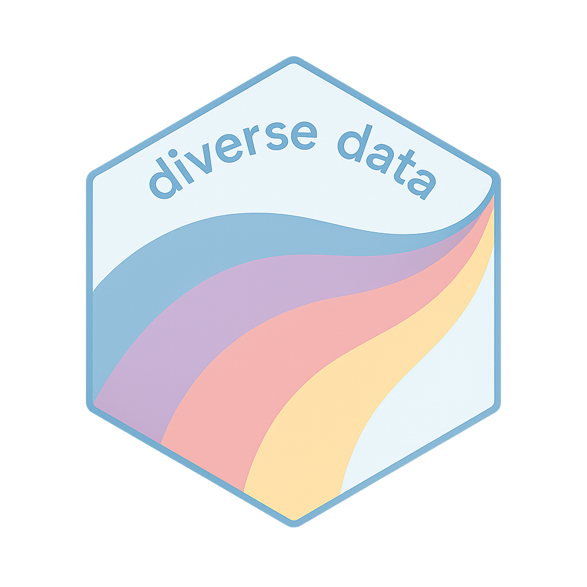

# diversedata 

## A curated collection of data sets on diverse topics

`diversedata` is an R package that provides a curated collection of real-world data sets centered on themes of equity, diversity and inclusion (EDI). These data sets are intended to support teaching, learning, and analysis by offering meaningful and socially relevant data that can be used in data science workflows.

Each data set includes contextual background and documentation to support thoughtful exploration. Example use cases are included to demonstrate practical applications in R.

For more information, visit the project website: <https://diverse-data-hub.github.io/>

------------------------------------------------------------------------

## Installation:

TBD
